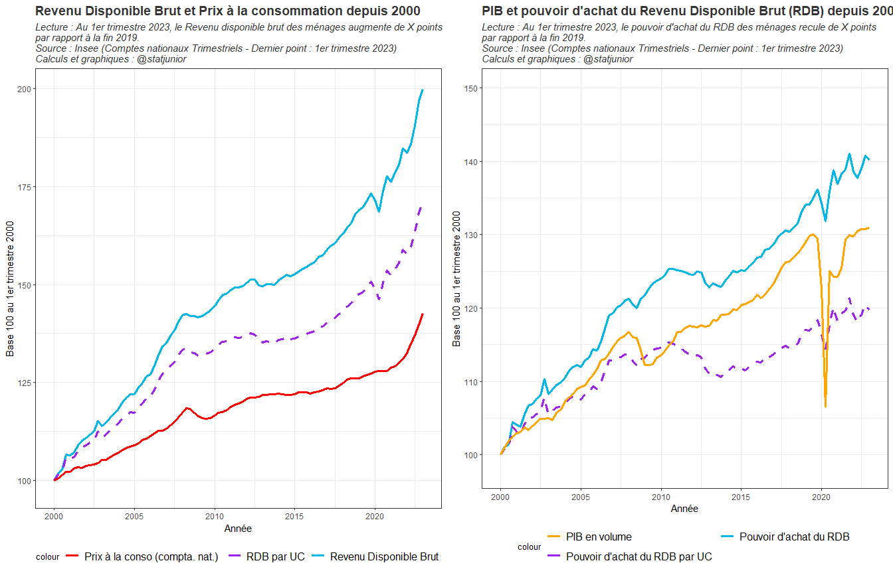
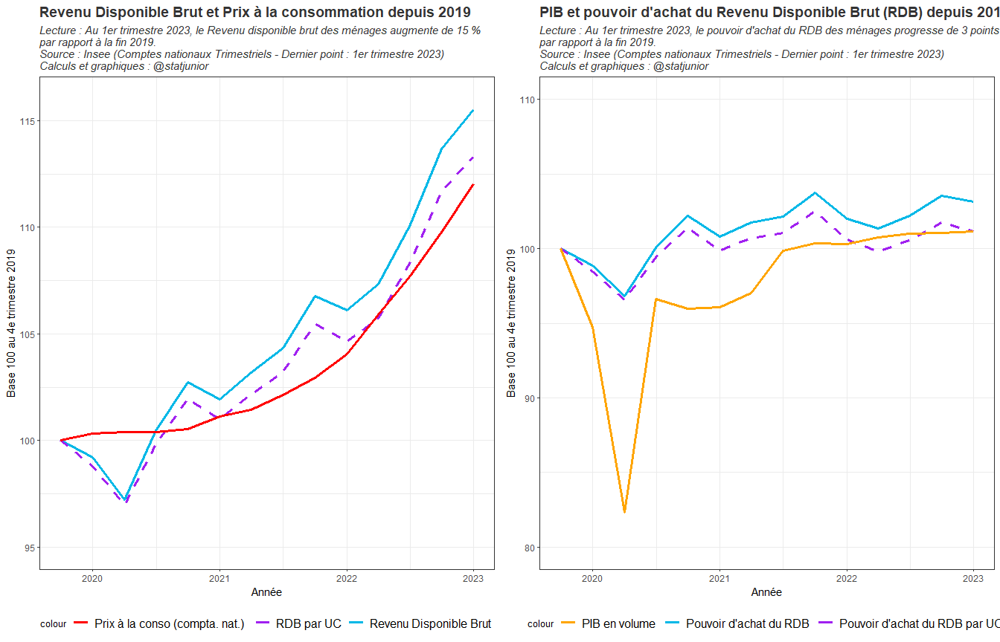
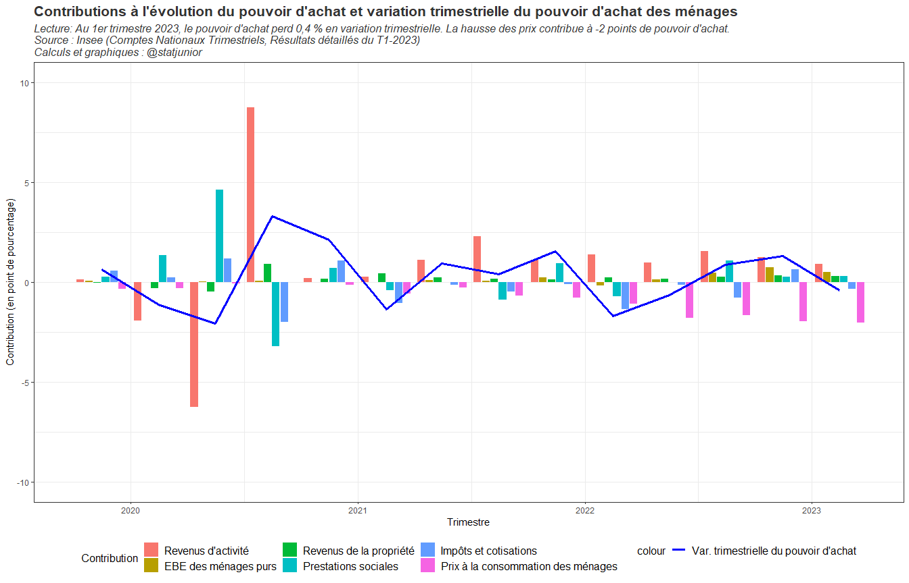
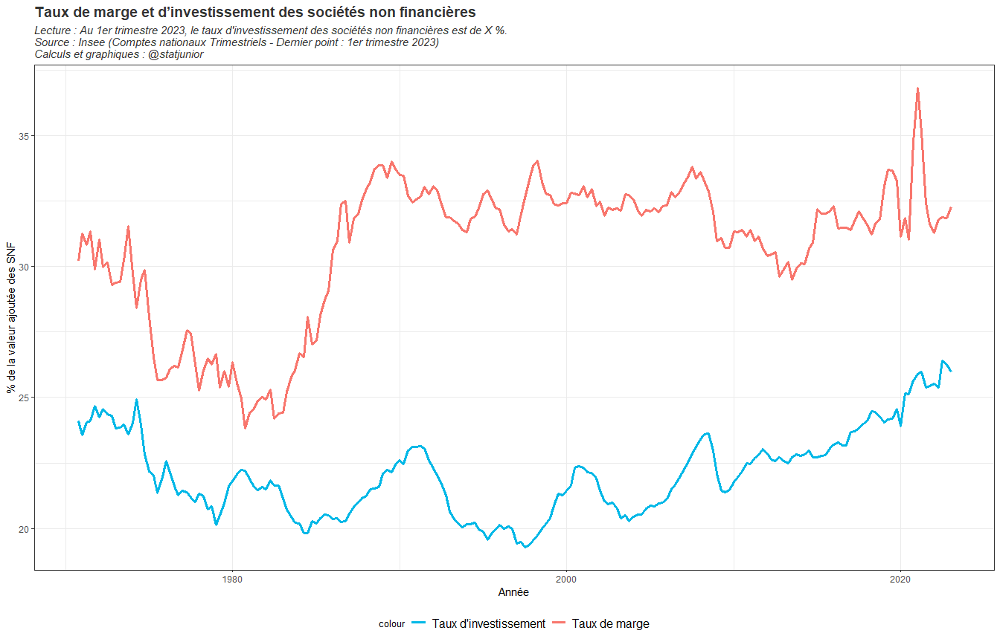
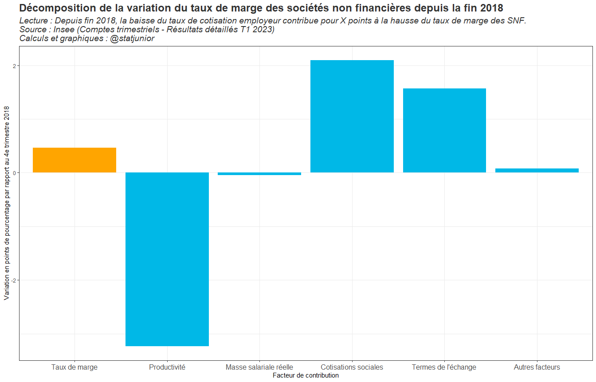
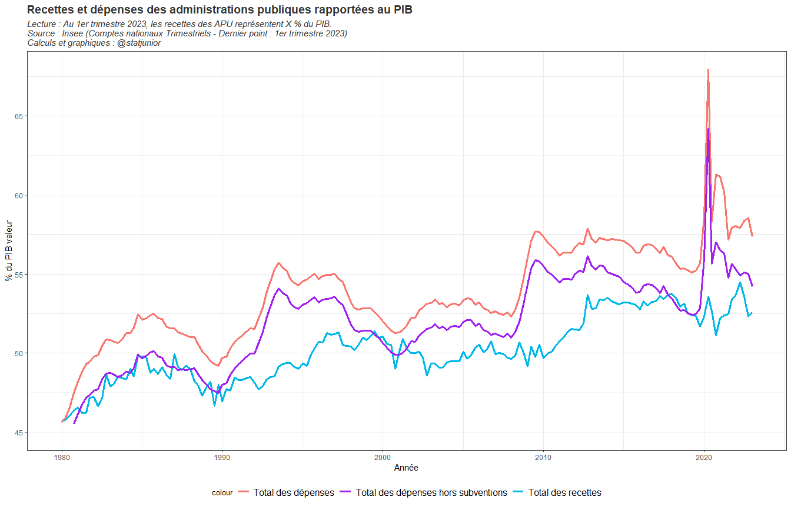
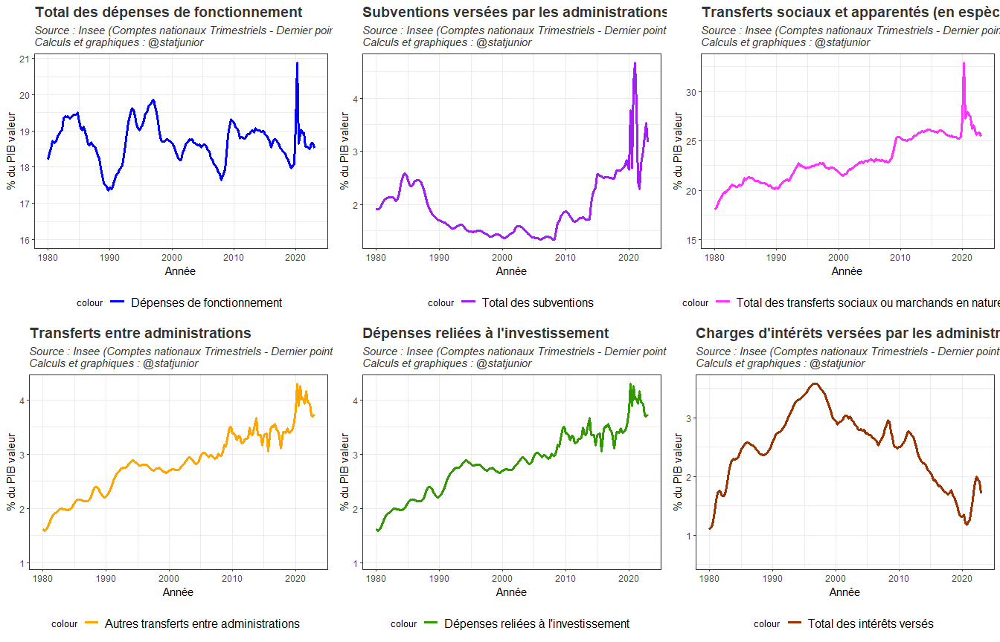
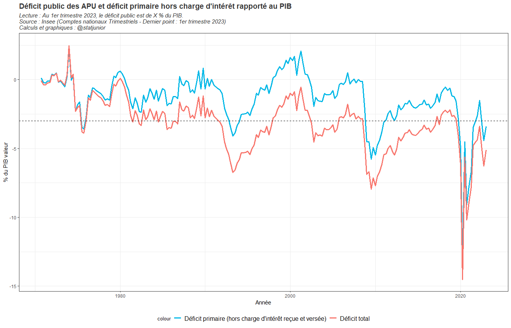
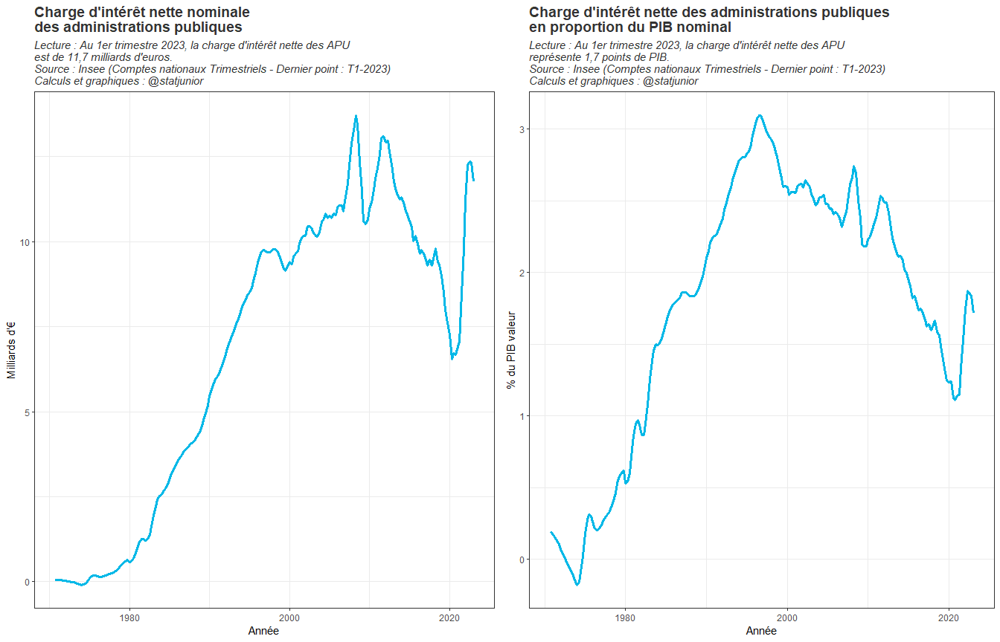

Comptes des secteurs institutionnels. Résultats détaillés des Comptes
Nationaux Trimestriels.
================
@statjunior
juin 27, 2023

- <a href="#1-présentation" id="toc-1-présentation">1 Présentation</a>
- <a href="#2-compte-des-ménages" id="toc-2-compte-des-ménages">2 Compte
  des ménages</a>
  - <a href="#21-revenu-disponible-brut-et-pouvoir-dachat-depuis-2000"
    id="toc-21-revenu-disponible-brut-et-pouvoir-dachat-depuis-2000">2.1
    Revenu disponible brut et pouvoir d’achat depuis 2000</a>
  - <a href="#22-revenu-disponible-brut-et-pouvoir-dachat-depuis-2019"
    id="toc-22-revenu-disponible-brut-et-pouvoir-dachat-depuis-2019">2.2
    Revenu disponible brut et pouvoir d’achat depuis 2019</a>
  - <a
    href="#23-décomposition-de-lévolution-du-pouvoir-dachat-des-ménages-depuis-2019"
    id="toc-23-décomposition-de-lévolution-du-pouvoir-dachat-des-ménages-depuis-2019">2.3
    Décomposition de l’évolution du pouvoir d’achat des ménages depuis
    2019</a>
  - <a href="#24-taux-dépargne-des-ménages"
    id="toc-24-taux-dépargne-des-ménages">2.4 Taux d’épargne des ménages</a>
- <a href="#3-compte-des-entreprises" id="toc-3-compte-des-entreprises">3
  Compte des entreprises</a>
  - <a
    href="#31-taux-de-marge-et-taux-dinvestissement-des-entreprises-sur-longue-période"
    id="toc-31-taux-de-marge-et-taux-dinvestissement-des-entreprises-sur-longue-période">3.1
    Taux de marge et taux d’investissement des entreprises sur longue
    période</a>
  - <a
    href="#32-décomposition-du-taux-des-marges-des-entreprises-depuis-2018"
    id="toc-32-décomposition-du-taux-des-marges-des-entreprises-depuis-2018">3.2
    Décomposition du taux des marges des entreprises depuis 2018</a>
- <a href="#4-comptes-des-administrations-publiques-apu"
  id="toc-4-comptes-des-administrations-publiques-apu">4 Comptes des
  administrations publiques (APU)</a>
  - <a href="#41-part-des-recettes-et-des-dépenses-des-apu"
    id="toc-41-part-des-recettes-et-des-dépenses-des-apu">4.1 Part des
    recettes et des dépenses des APU</a>
  - <a href="#42-décomposition-de-la-dépense-publique-par-fonctions"
    id="toc-42-décomposition-de-la-dépense-publique-par-fonctions">4.2
    Décomposition de la dépense publique par fonctions</a>
  - <a
    href="#43-taux-de-déficit-public-des-apu-avec-et-hors-charge-dintérêt"
    id="toc-43-taux-de-déficit-public-des-apu-avec-et-hors-charge-dintérêt">4.3
    Taux de déficit public des APU (avec et hors charge d’intérêt)</a>
  - <a
    href="#44-charge-dintérêt-nette-versée---reçue-des-administrations-publiques"
    id="toc-44-charge-dintérêt-nette-versée---reçue-des-administrations-publiques">4.4
    Charge d’intérêt nette (versée - reçue) des administrations
    publiques</a>
- <a
  href="#5-capacité-ou-besoin-de-financement-vis-à-vis-du-reste-du-monde"
  id="toc-5-capacité-ou-besoin-de-financement-vis-à-vis-du-reste-du-monde">5
  Capacité ou Besoin de financement vis-à-vis du Reste du monde</a>

# 1 Présentation

Ce rapport *RMarkdown* présente les résultats détaillés des comptes des
secteurs institutionnels (ménages, entreprises, administrations
publiques, reste du monde).

Le rapport présente successivement les grands indicateurs
macroéconomiques à retenir pour chaque agent économique.

Pour les ménages, on présente d’abord le revenu disponible brut et les
prix à la consommation en comptabilité nationale afin d’en déduire le
pouvoir d’achat des ménages. Le pouvoir d’achat des ménages est un
indicateur macroéconomique qui ne tient pas compte de la taille des
ménages et des économies d’échelle. C’est pourquoi on présente également
le pouvoir d’achat par unité de consommation (UC). Le pouvoir d’achat
des ménages par UC tient compte de la croissance de la population et des
économies ou d’échelle liées à la vie sous un même toit. Enfin, on
présente les contributions à l’évolution du pouvoir d’achat afin de
distinguer une variation liée aux revenus du travail, à la fiscalité,
aux prestations ou aux revenus du capital.

Pour les entreprises, on s’intéresse principalement aux sociétés non
financières (SNF). On présente tout d’abord leur taux de marge et leur
taux d’investissement sur longue période. Puis, on décompose les
contributions de l’évolution du taux de marge depuis 2018 (on retient
l’année 2018 car l’année 2019 est biaisée par la baisse de CICE).

On s’intéresse ensuite aux comptes des administrations publiques (APU).
On présente l’évolution des recettes et des dépenses publiques sur
longue période. On distingue ensuite l’évolution des dépenses par grande
composante. Enfin, on présente l’évolution du déficit public sur longue
période ainsi que la charge d’intérêt de la dette.

Enfin, on présente la situation de financement de l’économie française
vis à vis du reste du monde.

# 2 Compte des ménages

## 2.1 Revenu disponible brut et pouvoir d’achat depuis 2000

<!-- -->

## 2.2 Revenu disponible brut et pouvoir d’achat depuis 2019

<!-- -->

## 2.3 Décomposition de l’évolution du pouvoir d’achat des ménages depuis 2019

<!-- -->

## 2.4 Taux d’épargne des ménages

<!-- -->

# 3 Compte des entreprises

## 3.1 Taux de marge et taux d’investissement des entreprises sur longue période

<!-- -->

## 3.2 Décomposition du taux des marges des entreprises depuis 2018

<!-- -->

# 4 Comptes des administrations publiques (APU)

## 4.1 Part des recettes et des dépenses des APU

<!-- -->

## 4.2 Décomposition de la dépense publique par fonctions

<!-- -->

## 4.3 Taux de déficit public des APU (avec et hors charge d’intérêt)

<!-- -->

## 4.4 Charge d’intérêt nette (versée - reçue) des administrations publiques

<!-- -->

# 5 Capacité ou Besoin de financement vis-à-vis du Reste du monde

<!-- -->
