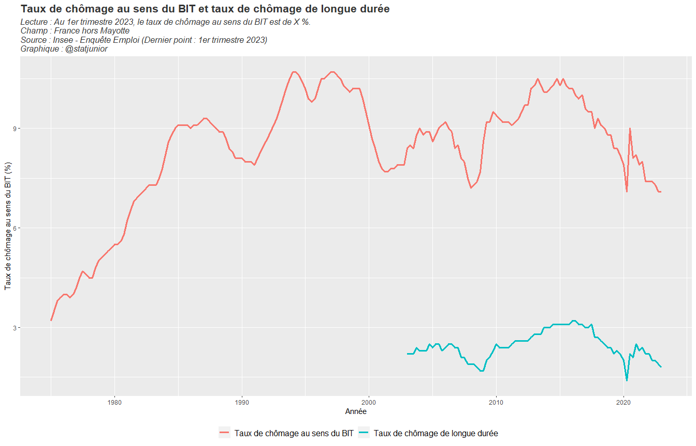
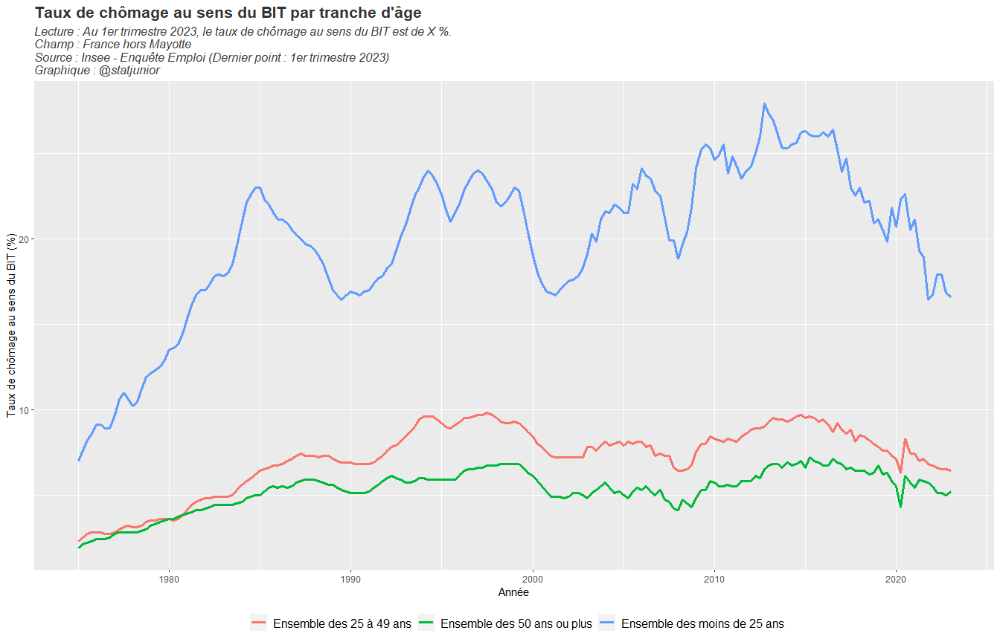
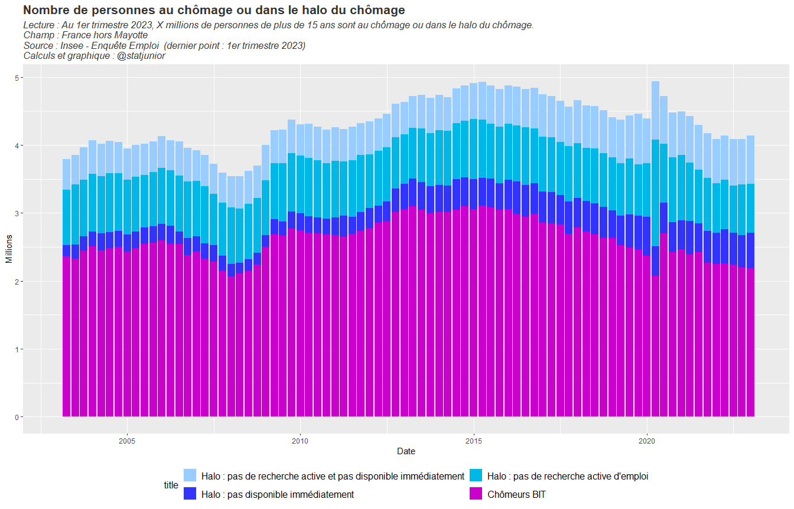

Chômage et contraintes d’emploi. Résultats de l’Enquête Emploi de
l’Insee
================
@statjunior
juillet 03, 2023

- <a href="#1-présentation" id="toc-1-présentation">1 Présentation</a>
- <a href="#2-taux-de-chômage" id="toc-2-taux-de-chômage">2 Taux de
  chômage</a>
  - <a href="#21-chômage-au-sens-du-bit-et-taux-de-chômage-de-longue-durée"
    id="toc-21-chômage-au-sens-du-bit-et-taux-de-chômage-de-longue-durée">2.1
    Chômage au sens du BIT et taux de chômage de longue durée</a>
  - <a href="#22-taux-de-chômage-bit-par-tranche-dâge"
    id="toc-22-taux-de-chômage-bit-par-tranche-dâge">2.2 Taux de chômage BIT
    par tranche d’âge</a>
  - <a
    href="#23-taux-de-chômage-élargi-bit--halo-du-chômage--sous-emploi-involontaire"
    id="toc-23-taux-de-chômage-élargi-bit--halo-du-chômage--sous-emploi-involontaire">2.3
    Taux de chômage élargi (BIT + halo du chômage + sous-emploi
    involontaire)</a>
    - <a href="#231-en-proportion-des-participants-au-marché-du-travail"
      id="toc-231-en-proportion-des-participants-au-marché-du-travail">2.3.1
      En proportion des participants au marché du travail</a>
    - <a href="#232-halo-du-chômage-par-tranche-dage"
      id="toc-232-halo-du-chômage-par-tranche-dage">2.3.2 Halo du chômage par
      tranche d’age</a>
- <a
  href="#3-nombre-de-personnes-au-chômage-ou-ayant-des-contraintes-demploi-halo-sous-emploi"
  id="toc-3-nombre-de-personnes-au-chômage-ou-ayant-des-contraintes-demploi-halo-sous-emploi">3
  Nombre de personnes au chômage ou ayant des contraintes d’emploi (halo,
  sous-emploi)</a>
  - <a href="#31-nombre-de-personnes-au-chomage-bit-ou-dans-le-halo"
    id="toc-31-nombre-de-personnes-au-chomage-bit-ou-dans-le-halo">3.1
    Nombre de personnes au chomage BIT ou dans le halo</a>
  - <a
    href="#32-part-des-personnes-comptées-comme-chômeurs-bit-parmi-les-chômeurs-semi-élargis-bit--halo-du-chomage"
    id="toc-32-part-des-personnes-comptées-comme-chômeurs-bit-parmi-les-chômeurs-semi-élargis-bit--halo-du-chomage">3.2
    Part des personnes comptées comme chômeurs BIT parmi les chômeurs
    semi-élargis (BIT + halo du chomage)</a>
  - <a href="#33-nombre-de-personnes-dans-le-halo-du-chômage"
    id="toc-33-nombre-de-personnes-dans-le-halo-du-chômage">3.3 Nombre de
    personnes dans le halo du chômage</a>
  - <a href="#34-nombre-de-personnes-en-sous-emploi"
    id="toc-34-nombre-de-personnes-en-sous-emploi">3.4 Nombre de personnes
    en sous-emploi</a>
  - <a
    href="#35-nombre-total-de-personnes-exprimant-des-contraintes-demploi--chômeurs-bit-halo-du-chomage-et-sous-emploi"
    id="toc-35-nombre-total-de-personnes-exprimant-des-contraintes-demploi--chômeurs-bit-halo-du-chomage-et-sous-emploi">3.5
    Nombre total de personnes exprimant des contraintes d’emploi : chômeurs
    BIT, halo du chomage et sous-emploi</a>

# 1 Présentation

Ce rapport **Rmarkdwon** synthétise les résultats sur le chômage et les
contraintes d’emploi exprimés dans l’Enquête Emploi sur la période
2003 - 2023. Le pas des graphiques est trimestriel. Le dernier point
connu est le 1er trimestre 2023.

Le rapport détaille les différentes catégories de contraintes d’emploi
exprimées dans l’emploi. D’une part, les chômeurs au sens du BIT, et
d’autre part les personnes dans le halo du chômage ou en situation de
sous-emploi contraint.

Le rapport présente à la fois les résultats en taux et en valeur absolue
(nombre de personnes concernées)

# 2 Taux de chômage

## 2.1 Chômage au sens du BIT et taux de chômage de longue durée

<!-- -->

## 2.2 Taux de chômage BIT par tranche d’âge

<!-- -->

## 2.3 Taux de chômage élargi (BIT + halo du chômage + sous-emploi involontaire)

### 2.3.1 En proportion des participants au marché du travail

<!-- -->

### 2.3.2 Halo du chômage par tranche d’age

<!-- -->

# 3 Nombre de personnes au chômage ou ayant des contraintes d’emploi (halo, sous-emploi)

## 3.1 Nombre de personnes au chomage BIT ou dans le halo

<!-- -->

## 3.2 Part des personnes comptées comme chômeurs BIT parmi les chômeurs semi-élargis (BIT + halo du chomage)

<!-- -->

## 3.3 Nombre de personnes dans le halo du chômage

<!-- -->

## 3.4 Nombre de personnes en sous-emploi

<!-- -->

## 3.5 Nombre total de personnes exprimant des contraintes d’emploi : chômeurs BIT, halo du chomage et sous-emploi

<!-- -->
