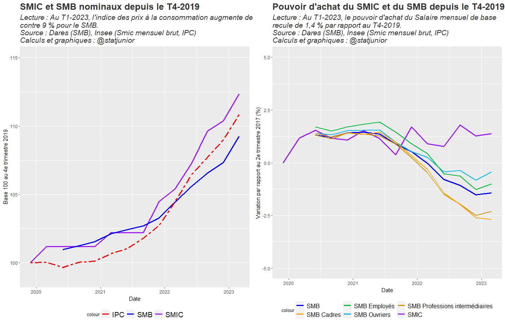
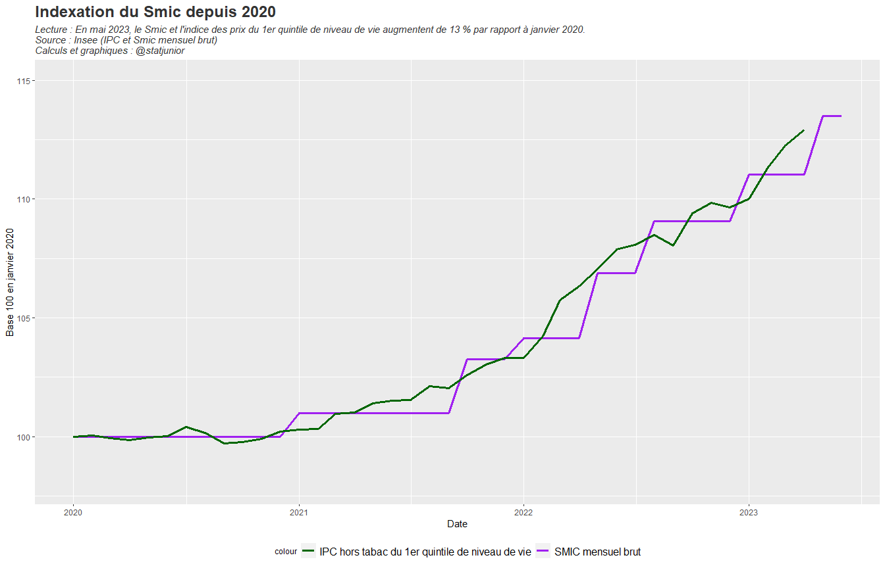
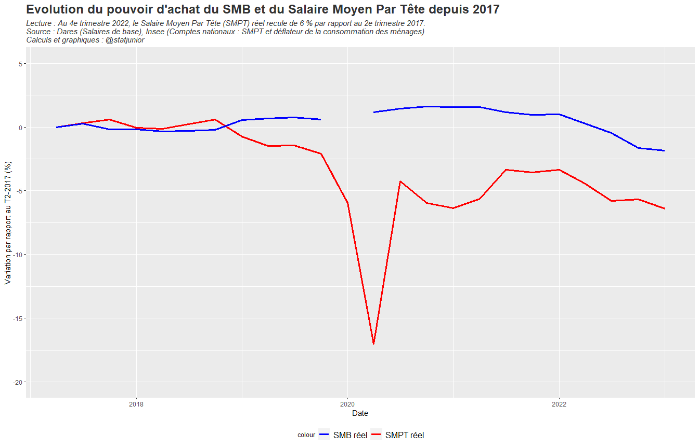
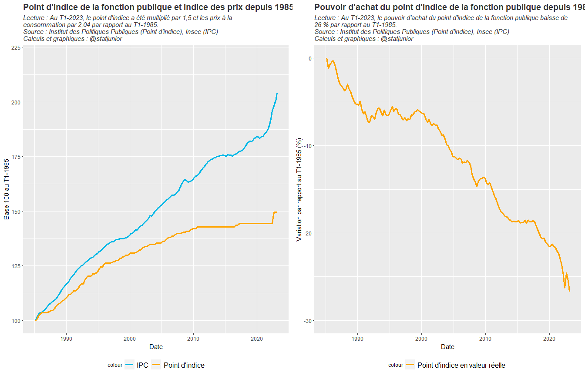

Evolution des salaires du secteur privé et du point d’indice de la
fonction publique sur longue période. Sources : Dares & Insee
================
@statjunior
juin 05, 2023

- <a href="#1-présentation" id="toc-1-présentation">1 Présentation</a>
- <a href="#2-salaire-mensuel-de-base-et-smic"
  id="toc-2-salaire-mensuel-de-base-et-smic">2 Salaire mensuel de base et
  Smic</a>
  - <a href="#21-depuis-la-crise-du-covid-fin-2019"
    id="toc-21-depuis-la-crise-du-covid-fin-2019">2.1 Depuis la crise du
    Covid (fin 2019)</a>
  - <a href="#22-depuis-2005" id="toc-22-depuis-2005">2.2 Depuis 2005</a>
- <a href="#3-indexation-du-smic-depuis-2020"
  id="toc-3-indexation-du-smic-depuis-2020">3 Indexation du SMIC depuis
  2020</a>
- <a
  href="#4-comparaison-du-pouvoir-dachat-du-smb-et-smpt-salaire-moyen-par-tête-en-comptabilité-nationale"
  id="toc-4-comparaison-du-pouvoir-dachat-du-smb-et-smpt-salaire-moyen-par-tête-en-comptabilité-nationale">4
  Comparaison du pouvoir d’achat du SMB et SMPT (Salaire Moyen Par Tête en
  Comptabilité nationale)</a>
- <a href="#5-evolution-du-point-dindice-de-la-fonction-publique"
  id="toc-5-evolution-du-point-dindice-de-la-fonction-publique">5
  Evolution du point d’indice de la fonction publique</a>

# 1 Présentation

Ce rapport *RMarkdown* présente l’évolution des salaires du secteur
privé et du point d’indice de la fonction publique sur longue période.

Dans un premier temps, on représente l’évolution du Smic et des
différents indices de Salaires mensuels de base (SMB) par catégorie
socio-professionnelle depuis le Covid et depuis 2005.

Dans un deuxième temps, on représente l’indexation du Smic par rapport à
l’inflation hors tabac du 1er quintile de niveau de vie depuis 2005.

L’évolution du pouvoir d’achat du SMB (indicateur microéconomique
d’évolution des salaires) est comparé au pouvoir d’achat du SMPT
(Salaire Moyen par Tête de la comptabilité nationale).

Enfin, on s’intéresse à l’évolution du point d’indice de la fonction
publique par rapport aux prix depuis 1985.

# 2 Salaire mensuel de base et Smic

## 2.1 Depuis la crise du Covid (fin 2019)

<!-- -->

## 2.2 Depuis 2005

<!-- -->

# 3 Indexation du SMIC depuis 2020

<!-- -->

# 4 Comparaison du pouvoir d’achat du SMB et SMPT (Salaire Moyen Par Tête en Comptabilité nationale)

<!-- -->

# 5 Evolution du point d’indice de la fonction publique

<!-- -->
